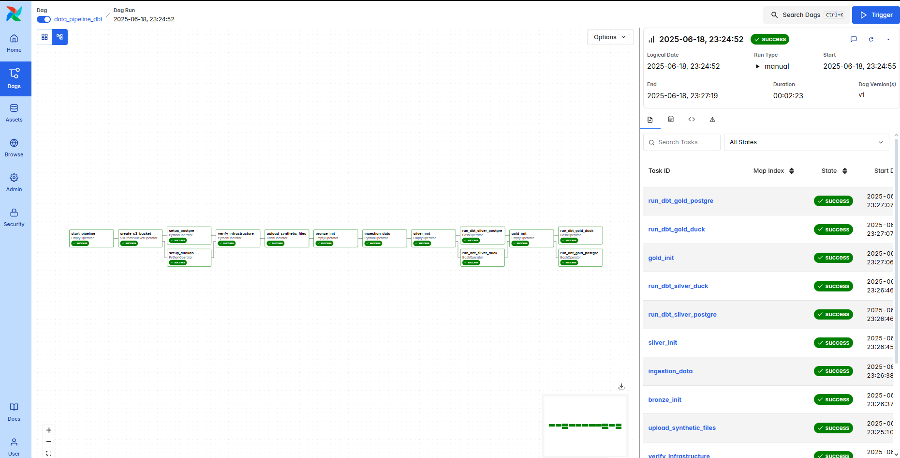

# 🛒 E-Commerce Data Pipeline with DBT, DuckDB, and Airflow



This project is a modern end-to-end data pipeline for an e-commerce platform, using a medallion architecture (Bronze → Silver → Gold) powered by **DBT**, **DuckDB**, **PostgreSQL**, and **Apache Airflow**. It processes raw transactional data into clean, reliable, and analytics-ready models.

---

## 🏗️ Architecture Overview

- **Bronze Layer**: Raw data ingestion (CSV/API/Extracts) into DuckDB/PostgreSQL.
- **Silver Layer**: Data cleaning, deduplication, standardization, and enriching.
- **Gold Layer**: Business-ready fact and dimension models for analytics.

All transformations and tests are handled using **DBT**. Workflow orchestration is managed by **Apache Airflow**.

---

## 🧊 Tools Used

| Tool           | Purpose                                       |
| -------------- | --------------------------------------------- |
| DBT            | Data transformation and testing               |
| DuckDB         | Local development and fast prototyping        |
| PostgreSQL     | Serving layer for analytics-ready tables      |
| Apache Airflow | Orchestration and scheduling of pipeline jobs |

---

## 🔍 Data Model Summary

### 🔹 Dimension Tables (Gold Layer)

- `customers_dim`: Customer details with age group and tenure.
- `products_dim`: Product catalog with price range, weight, photo quality.
- `sellers_dim`: Seller profile including tenure and rating.
- `geography_dim`: Location mapping from customer and seller.
- `dates_dim`: Calendar table with day/week/month/year breakdowns.

### 🔸 Fact Tables (Gold Layer)

- `orders_facts`: Order-level financials and delivery metrics.
- `order_items_facts`: Item-level costs, coupons, shipping types.
- `payments_facts`: Payment method insights and complexity.
- `seller_performance_facts`: Monthly seller KPIs.
- `product_performance_facts`: Product market share and category revenue.

All tables are tested using DBT's built-in tests and `dbt-utils` for accepted ranges, foreign key integrity, and uniqueness.

---

## 🧪 Testing Strategy

- **Uniqueness & Not Null**: Keys and important metrics.
- **Referential Integrity**: Foreign key relationships.
- **Accepted Values**: Controlled enums (e.g., day of week, booleans).
- **Range Validations**: Revenue, rates, percentages, item counts.

---

## 🚀 Running the Pipeline

1. **Install DBT & Dependencies**:

   ```bash
   pip install dbt-core dbt-postgres dbt-duckdb dbt-utils
   ```

2. **Set up Airflow DAGs** to orchestrate the extraction and DBT runs.

3. **Run DBT models**:

   ```bash
   dbt run --target dev
   dbt test --target dev
   ```

4. **Promote to Production** (PostgreSQL or similar).

---

## 📁 Directory Structure

```bash
.
├── dags/                  # Airflow DAG definitions
├── models/                # dbt models (bronze/silver/gold)
├── seeds/                 # Raw CSV data (if applicable)
├── tests/                 # Custom DBT tests
├── dbt_project.yml        # DBT project config
└── schema.yml             # Model documentation and tests
```

---

## 📈 Use Cases & Analytics

- Customer segmentation by age/tenure
- Product pricing vs. photo quality insights
- Seller performance monitoring over time
- Payment method complexity for checkout optimization
- Regional sales analysis using `geography_dim`

---

## 👤 Author

**Franz B. Monzales**
Data Engineer | Python / SQL / DBT / Airflow
📍 Davao City, PH

---

## 📜 License

MIT License. Feel free to reuse and modify.
