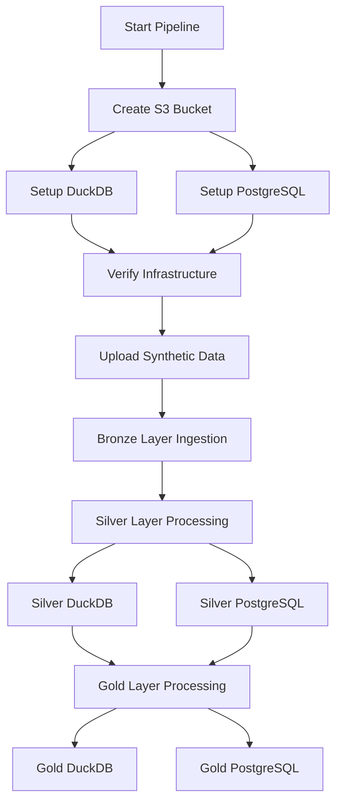

# 🛒 E-Commerce Data Pipeline with DBT, DuckDB, and Airflow


A modern, production-ready end-to-end data pipeline for e-commerce analytics, implementing a medallion architecture (Bronze → Silver → Gold) with **DBT**, **DuckDB**, **PostgreSQL**, and **Apache Airflow**. This pipeline transforms raw transactional data into clean, tested, and analytics-ready dimensional models.

---

## 🏗️ Architecture Overview

This pipeline follows the **Medallion Architecture** pattern with three distinct layers:

- **🥉 Bronze Layer**: Raw data ingestion from CSV files, APIs, and external sources into DuckDB/PostgreSQL
- **🥈 Silver Layer**: Data cleaning, deduplication, standardization, and business rule application
- **🥇 Gold Layer**: Analytics-ready fact and dimension tables optimized for business intelligence

### Dual-Target Strategy

- **Development (DuckDB)**: Fast local development and testing with `dev` target
- **Production (PostgreSQL)**: Scalable production environment with `prod` target

All transformations are version-controlled and tested using **DBT**. Workflow orchestration and scheduling are managed by **Apache Airflow**.

---

## 🛠️ Technology Stack

| Component          | Technology     | Purpose                                   |
| ------------------ | -------------- | ----------------------------------------- |
| **Transformation** | DBT Core       | Data modeling, testing, and documentation |
| **Development DB** | DuckDB         | Local development and fast prototyping    |
| **Production DB**  | PostgreSQL     | Production data warehouse                 |
| **Orchestration**  | Apache Airflow | Pipeline scheduling and monitoring        |
| **Storage**        | Minio S3       | Raw data storage and backup               |
| **Language**       | SQL + Python   | Data transformations and pipeline logic   |

---

## 📊 Data Model Architecture

### 🥇 Gold Layer - Dimensional Model

#### Dimension Tables

- **`customers_dim`**: Customer profiles with demographics, age groups, and tenure analytics
- **`products_dim`**: Product catalog with pricing tiers, weight categories, and photo quality metrics
- **`sellers_dim`**: Seller profiles including performance ratings and business tenure
- **`geography_dim`**: Geographic hierarchies for customers and sellers
- **`dates_dim`**: Calendar dimension with fiscal periods and holiday indicators

#### Fact Tables

- **`orders_facts`**: Order-level metrics including financials and delivery performance
- **`order_items_facts`**: Line-item details with pricing, discounts, and shipping analysis
- **`payments_facts`**: Payment method analytics and transaction complexity
- **`seller_performance_facts`**: Monthly seller KPIs and performance trends
- **`product_performance_facts`**: Product market share and category revenue analysis

### 🧍️ Bronze Layer - Raw Data

**Schema:** `bronze`
These are unmodified source tables ingested via Python scripts:

- **raw_customers** – Raw customer data loaded via Python ingestion
- **raw_orders**
- **raw_order_items**
- **raw_products**
- **raw_sellers**
- **raw_payments**
- **raw_geolocations**

Each table includes:

- Data lineage and ingestion timestamp via `processed_at`
- Retention of historical, untransformed records
- Freshness expectations (e.g., `raw_customers` warns if data is over 12 hours old)

---

### 🥈 Silver Layer - Cleaned & Validated Data

These models represent transformed, enriched, and validated datasets built on top of the bronze layer:

- **customers** – Cleaned customer profiles with age filtering, gender standardization, and city/region tagging
- **orders** – Orders with delivery metrics and normalized statuses
- **order_items** – Item-level transactions with calculated discounts and total costs
- **products** – Product catalog with cleaned names, category labels, and calculated volume
- **sellers** – Seller data with fulfillment classification and rating categories
- **payments** – Payments classified by method, installment plans, and derived payment categories
- **geolocations** – Validated location data with cleaned city/region and geographic bounds validation

Each table includes:

- Column-level constraints (e.g., `not_null`, `unique`, and value ranges)
- Enriched fields like `delivery_performance`, `product_volume_cm3`, `discounted_price`
- Transformation timestamps using `processed_at`

---

## 🧪 Data Quality & Testing

Our comprehensive testing strategy ensures data reliability:

### DBT Tests

- **Schema Tests**: Uniqueness, not null, referential integrity
- **Data Tests**: Accepted values, ranges, and business rule validation
- **Custom Tests**: Complex business logic validation using `dbt-utils`

### Test Coverage

- **Primary Keys**: Uniqueness across all dimension and fact tables
- **Foreign Keys**: Referential integrity between facts and dimensions
- **Business Rules**: Revenue calculations, date validations, status enums
- **Data Ranges**: Price limits, quantity bounds, percentage validations

### Quality Metrics

```sql
-- Example test configurations
- name: orders_facts
  tests:
    - unique:
        column_name: order_id
    - not_null:
        column_name: order_date
    - accepted_values:
        column_name: order_status
        values: ['pending', 'processing', 'shipped', 'delivered', 'cancelled']
```

---

## 🚀 Getting Started

### Prerequisites

- Python 3.8+
- Docker and Docker Compose
- AWS CLI configured (for S3 access)
- PostgreSQL server (for production)

### Installation

### Installation (Docker + Airflow Setup)

1. **Clone the repository**:

   ```bash
   git clone <repository-url>
   cd ecommerce-data-pipeline
   ```

2. **Set up environment variables**:

   ```bash
   cp .env.example .env
   # Update .env with your database connections, AWS credentials, and Airflow configs
   ```

3. **Start the Docker containers**:

   ```bash
   docker-compose up --build -d
   ```

   This will spin up the following services:

   - Apache Airflow (Scheduler, Webserver, Worker)
   - PostgreSQL
   - Redis (for Celery)
   - MinIO (S3-compatible storage)
   - Optional: Spark, Jupyter, etc.

4. **Initialize Airflow metadata DB and create user**:

   ```bash
   docker-compose exec airflow-webserver airflow db migrate
   docker-compose exec airflow-webserver airflow users create \
     --username admin \
     --password admin \
     --firstname Admin \
     --lastname User \
     --role Admin \
     --email admin@example.com
   ```

5. **Access the Airflow UI**:

   Open your browser and go to [http://localhost:8080](http://localhost:8080)
   Login with the credentials you just created.

6. **Install Python dependencies for local dev (optional)**:

   ```bash
   pip install -r requirements.txt
   # Includes dbt-core, dbt-postgres, dbt-duckdb, dbt-utils, apache-airflow, pandas, boto3, etc.
   ```

### Configuration

#### DBT Profiles (`profiles.yml`)

```yaml
data_pipeline_e_commerce:
  target: dev
  outputs:
    dev:
      type: duckdb
      path: "data/dev_warehouse.duckdb"
      schema: main
    prod:
      type: postgres
      host: "{{ env_var('POSTGRES_HOST') }}"
      user: "{{ env_var('POSTGRES_USER') }}"
      password: "{{ env_var('POSTGRES_PASSWORD') }}"
      port: 5432
      dbname: ecommerce_dw
      schema: public
```

---

## 🔄 Running the Pipeline

### Development Workflow

1. **Start Airflow**:

   ```bash
   airflow webserver --port 8080
   airflow scheduler
   ```

2. **Run DBT models locally**:

   ```bash
   # Development environment (DuckDB)
   dbt run --target dev --select tag:bronze
   dbt run --target dev --select tag:silver
   dbt run --target dev --select tag:gold

   # Run tests
   dbt test --target dev
   ```

3. **Generate documentation**:
   ```bash
   dbt docs generate --target dev
   dbt docs serve --port 8001
   ```

### Production Deployment

1. **Trigger the full pipeline via Airflow**:

   - Access Airflow UI at `http://localhost:8080`
   - Enable and trigger the `data_pipeline_dbt` DAG

2. **Monitor pipeline execution**:
   - Track progress through Airflow's task monitoring
   - Review DBT logs for transformation details
   - Validate data quality through test results

### Pipeline Execution Flow



---

## 📁 Project Structure

```
ecommerce-data-pipeline/
├── dags/                          # Airflow DAG definitions
│   ├── data_pipeline_dbt.py       # Main pipeline DAG
│   └── functions/                 # Custom Python functions
│       ├── bronze.py              # Infrastructure setup
│       └── data_created.py        # Synthetic data generation
├── dbt/                           # DBT project root
│   ├── models/                    # DBT models
│   │   ├── bronze/                # Raw data models
│   │   ├── silver/                # Cleaned data models
│   │   └── gold/                  # Analytics-ready models
│   │       ├── dimensions/        # Dimension tables
│   │       └── facts/             # Fact tables
│   ├── tests/                     # Custom DBT tests
│   ├── macros/                    # Reusable SQL macros
│   ├── seeds/                     # Static reference data
│   ├── snapshots/                 # Slowly changing dimensions
│   ├── dbt_project.yml            # DBT configuration
│   └── profiles.yml               # Database connections
├── data/                          # Local data storage
├── logs/                          # Application logs
├── requirements.txt               # Python dependencies
├── .env.example                   # Environment variables template
└── README.md                      # This file
```

---

## 📈 Business Use Cases & Analytics

### Customer Analytics

- **Segmentation**: Age groups, tenure, and purchasing behavior
- **Lifetime Value**: Customer profitability analysis
- **Retention**: Cohort analysis and churn prediction

### Product Intelligence

- **Performance**: Sales trends and category analysis
- **Pricing**: Price elasticity and competitive positioning
- **Quality**: Photo quality impact on conversion rates

### Seller Management

- **Performance**: Monthly KPIs and rating trends
- **Onboarding**: New seller success metrics
- **Commission**: Revenue sharing and fee optimization

### Operational Insights

- **Payment Methods**: Transaction complexity and success rates
- **Geography**: Regional sales performance and expansion opportunities
- **Delivery**: Shipping performance and logistics optimization

---

## 🔧 Configuration Variables

Key variables defined in `dbt_project.yml`:

| Variable                   | Default    | Description                      |
| -------------------------- | ---------- | -------------------------------- |
| `start_date`               | 2020-01-01 | Historical data processing start |
| `end_date`                 | 2025-12-31 | Data processing cutoff           |
| `min_order_value`          | 0.01       | Minimum valid order amount       |
| `max_order_value`          | 10000.00   | Maximum valid order amount       |
| `exclude_cancelled_orders` | true       | Filter cancelled orders          |
| `include_test_customers`   | false      | Include test data in production  |

---

## 📚 Documentation & Resources

- **DBT Docs**: Auto-generated at `http://localhost:8001` after running `dbt docs serve`
- **Airflow UI**: Pipeline monitoring at `http://localhost:8080`
- **Data Lineage**: Visual representation available in DBT docs
- **Test Results**: Comprehensive test coverage reports in DBT output

---

## 🤝 Contributing

1. Fork the repository
2. Create a feature branch (`git checkout -b feature/amazing-feature`)
3. Commit your changes (`git commit -m 'Add amazing feature'`)
4. Push to the branch (`git push origin feature/amazing-feature`)
5. Open a Pull Request

### Development Guidelines

- All models must include tests and documentation
- Follow naming conventions: `<layer>_<entity>_<type>`
- Ensure backward compatibility when modifying existing models
- Update documentation for any schema changes

---

## 🐛 Troubleshooting

### Common Issues

**DBT Connection Errors**:

```bash
# Verify profile configuration
dbt debug --target dev

# Check database connectivity
dbt run-operation check_connections
```

**Airflow Task Failures**:

- Check Airflow logs in the UI
- Verify environment variables are set
- Ensure database connections are active

**Data Quality Issues**:

```bash
# Run specific tests
dbt test --select test_type:singular
dbt test --models orders_facts
```

---

## 👤 About

**Author**: Franz Monzales
**Email**: ikigamidevs@gmail.com
**LinkedIn**: [\[Your LinkedIn Profile\] ](https://www.linkedin.com/in/franz-monzales-671775135/details/projects/)
**Location**: 📍 Davao City, PH

---

## 📜 License

This project is licensed under the MIT License - see the [LICENSE](LICENSE) file for details.

---

## 🙏 Acknowledgments

- DBT Community for excellent documentation and resources
- Airflow team for robust orchestration capabilities
- Open source contributors who made this project possible
